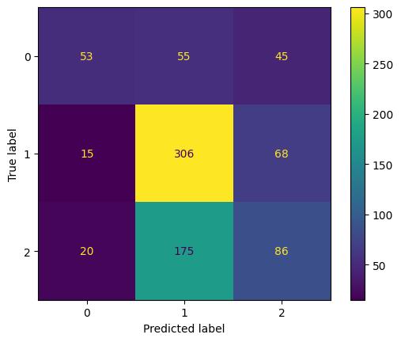

# AutoJudge – Programming Problem Difficulty Predictor

AutoJudge is a machine learning system that automatically predicts the **difficulty of programming problems** using **only textual descriptions**.  
The system predicts both:

- **Difficulty Class** → Easy / Medium / Hard *(classification)*
- **Difficulty Score** → Numerical value *(regression)*

## Table of Contents
- Overview  
- Dataset  
- Features  
- Models Used  
  - Classification Models  
  - Regression Models  
- Results  
- Web Application  
- Project Structure  
- How to Run  

## Overview

Online coding platforms such as Codeforces, CodeChef, and Kattis assign difficulty levels to problems based on expert opinions and user feedback. AutoJudge attempts to **automate this process** by learning patterns from existing labeled problem descriptions.

The system is trained using textual fields such as:
- Problem description
- Input description
- Output description

## Dataset

Each data sample contains:
- `title`
- `description`
- `input_description`
- `output_description`
- `problem_class` (Easy / Medium / Hard)
- `problem_score` (numerical)

## Features

### Text Processing
- All text fields were combined into a single text input
- Text was converted to lowercase

### Text Features
- **TF-IDF (Term Frequency – Inverse Document Frequency)** was used to convert text into numerical vectors
- This captures important words while reducing the effect of common words

### Numeric Features
Additional handcrafted numeric features were added:
- Text length
- Word count
- Keyword indicators (graph, dp, recursion, bfs, dfs, greedy, etc.)

These numeric features were **scaled when required** (e.g., for SVM).

## Models Used

### Classification Models (Predict Difficulty Class)

#### 1. Logistic Regression (Final Model)
#### 2. Support Vector Machine (Linear SVM)
#### 3. Random Forest Classifier

### Regression Models (Predict Difficulty Score)

#### 1. Ridge Regression (Final Model)
#### 2. Random Forest Regressor
#### 3. Gradient Boosting Regressor

## Results

### Classification Results

| Model | Accuracy |
| Logistic Regression | 54% |
| Linear SVM | 52.24% |
| Random Forest | 52.61% |

#### Logistic Regression – Confusion Matrix

### Regression Results

| Model | MAE | RMSE |
|------|-----|------|
| Ridge Regression | 1.65 | 1.99 |
| Random Forest Regressor | 1.69 | 2.02 |
| Gradient Boosting Regressor | 1.68 | 2.015 |

## Web Application

A **Streamlit-based web application** was developed to demonstrate real-time predictions.

### Features:
- User can paste problem descriptions
- Predicts difficulty class and score instantly
- Uses the same preprocessing and feature pipeline as training

## Project Structure

AutoJudge/
├── app.py
├── README.md
├── requirements.txt
├── .gitignore
├── notebooks/
├── data/
│   └── processed/
└── models/ 

## How to run
pip install -r requirements.txt
streamlit run app.py